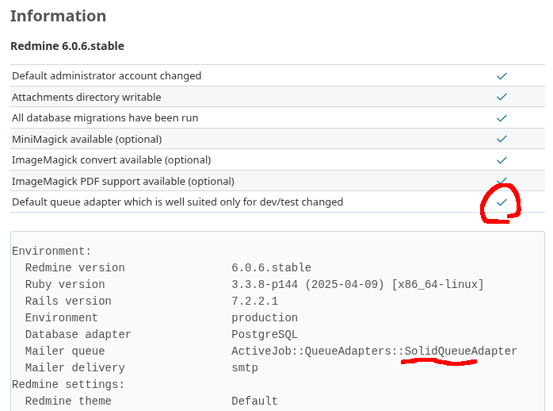

# Redmine Solid Queue plugin: Easiest Solid Queue installation way for Redmine

[](https://raw.githubusercontent.com/nishidayuya/redmine_solid_queue/master/LICENSE.txt)
[](https://github.com/nishidayuya/redmine_solid_queue/tags)

## Installation

### Setup tables

Clone the plugin into your Redmine plugins directory.

```console
$ cd /path/to/redmine/plugins/
$ git clone https://github.com/nishidayuya/redmine_solid_queue.git
```

Run `redmine:plugins:migrate`

```console
$ cd /path/to/redmine/
$ bin/rails redmine:plugins:migrate
```

Restart your Redmine.

Browse to Information tab from Redmine Administration page(/admin/info) and check below:



### Run job supervisor

#### Puma application server case:

`redmine_solid_queue` automatically runs job supervisor.

If you don't need automatically running, set an environment `REDMINE_SOLID_QUEUE_DISABLE_PUMA_PLUGIN=1` to Redmine, and setup [Other application server case:](#other-application-server-case)

#### Other application server case:

Temporary start job supervisor in order to process the queue and send the emails:

```console
$ export SECRET_KEY_BASE=1234567890abcdef1234567890abcdef  # if needed

$ RAILS_ENV=production plugins/redmine_solid_queue/bin/jobs start
```

Output example of startup process:

```
I, [2025-08-03T17:07:29.504850 #687084]  INFO -- : SolidQueue-1.2.0 Started Supervisor (90.1ms)  pid: 687084, hostname: "yoshiyuki", process_id: 86, name: "supervisor-f74eb0dbbb9a068755d8"
I, [2025-08-03T17:07:29.557808 #687107]  INFO -- : SolidQueue-1.2.0 Started Dispatcher (46.0ms)  pid: 687107, hostname: "yoshiyuki", process_id: 87, name: "dispatcher-a75e9ca8e30e070bfc0a", polling_interval: 1, batch_size: 500, concurrency_maintenance_interval: 600
I, [2025-08-03T17:07:29.559142 #687111]  INFO -- : SolidQueue-1.2.0 Started Worker (42.5ms)  pid: 687111, hostname: "yoshiyuki", process_id: 88, name: "worker-229534c81ee3c5f8c8d3", polling_interval: 0.1, queues: "*", thread_pool_size: 3
```

Output example of job processing:

```
I, [2025-08-03T17:10:43.773655 #687589]  INFO -- : [ActiveJob] [Mailer::DeliveryJob] [243c623f-381f-427f-829e-616017f6c0af] Performing Mailer::DeliveryJob (Job ID: 243c623f-381f-427f-829e-616017f6c0af) from SolidQueue(mailers) enqueued at 2025-08-03T08:10:43.338456955Z with arguments: "Mailer", "issue_edit", "deliver_now", {:args=>[#<GlobalID:0x00007f165e4059e0 @uri=#<URI::GID gid://redmine-app/User/1>>, #<GlobalID:0x00007f165e405350 @uri=#<URI::GID gid://redmine-app/Journal/9>>]}
I, [2025-08-03T17:10:44.440619 #687589]  INFO -- : [ActiveJob] [Mailer::DeliveryJob] [243c623f-381f-427f-829e-616017f6c0af] Performed Mailer::DeliveryJob (Job ID: 243c623f-381f-427f-829e-616017f6c0af) from SolidQueue(mailers) in 787.25ms
```

If everything went well, stop the command.

Configure job supervisor to run as a system service: see https://www.redmine.org/projects/redmine/wiki/SolidQueueConfiguration#5-Configure-Solid-Queue-supervisor-to-run-as-a-system-service and use `plugins/redmine_solid_queue/bin/jobs` instead of `bin/jobs`

## Uninstallation

Run `redmine:plugins:migrate` to remove `redmine_solid_queue` plugin's table.

```console
$ cd /path/to/redmine/
$ bin/rails redmine:plugins:migrate NAME=redmine_solid_queue VERSION=0
```

Remove plugin directory

```console
$ cd /path/to/redmine/plugins/
$ rm -rf redmine_solid_queue_plugin
```
